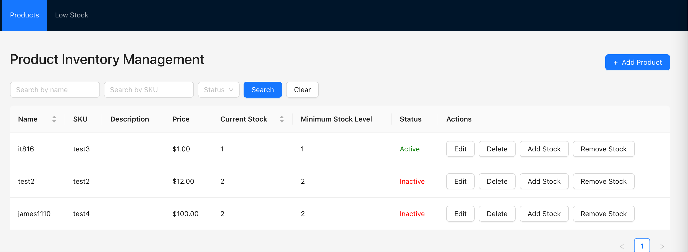
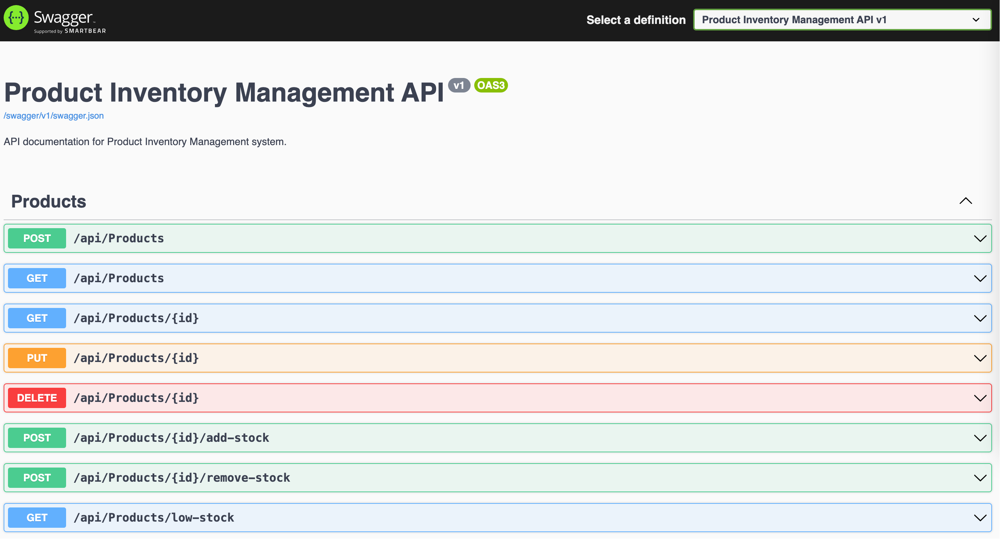

# Product Inventory Management

This is a full stack project with a C# .NET backend (Web API) and a React frontend for managing product inventory.

## Features

- Product listing with search and filter capabilities
- Add new products
- Edit existing products
- Delete products
- Stock management (add/remove stock)
- Low stock monitoring
- Active/Inactive product status

## Screenshots

### Main Product List

*The main interface showing the product list with search, filter, and action buttons*

### Add New Product

*Modal form for adding new products to the inventory*

### API Documentation (Swagger UI)

*Swagger UI showing the available API endpoints and models*

## Project Structure
- `backend/` - C# .NET Web API backend
- `frontend/` - React frontend

## Getting Started

### Backend
1. Navigate to the `backend` folder:
   ```sh
   cd backend
   ```
2. Run the backend:
   ```sh
   dotnet run
   ```

### Frontend
1. Navigate to the `frontend` folder:
   ```sh
   cd frontend
   ```
2. Start the React app:
   ```sh
   npm start
   ```

## Development
- The backend runs on .NET (default: http://localhost:5000)
- The frontend runs on React (default: http://localhost:3000)

## Next Steps
- Implement product inventory features in both backend and frontend.
